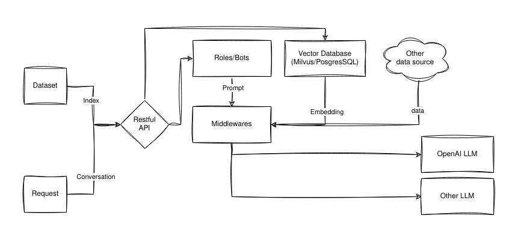

# Botastic

An AI framework for building cool things.

## 👀 Overview



## 💡 Motivation

- LLMs are fantastic for knowledge generation and reasoning as they're pre-trained on large amounts of publicly available data.
- In practice, we need LLMs to be able to reason about our own data. Fine-tuning them is often impractical. Embedding data into LLMs is a viable alternative, but requires domain expertise, and considerable effort to dealing with prompt limitations
- Botastic aims to make it easy to embed your own data into LLMs.
- Botastic also aims to provide out-of-the-box solutions to satisfy common use cases.
- It would to be easily integrated into existing systems and scalable to meet business requirements.
- We're building AI-based applications, we need Botastic to simplify the process.

## 🚀 Features

- [x] 🔌 Connect to OpenAI's LLM
- [x] 💾 Store and manage your own data as LLM's external brain
- [x] 🌐 Restful APIs 
- [x] 💬 Conversations management to help you build dialogue interface based applications
- [x] 🤖 Bot/Avatar management and builtin useful bots: emotion recognition, sentiment analysis, spam checker, etc. Please refer to [TBD].
- [ ] 🧩 Customize Middlewares to extend Botastic's functionality
- [ ] 💾 Store vectors in Postgres and other databases
- [ ] 📦 Better strategies to split the data and build text chunks
- [ ] 📤 Export data
- [ ] 🙋‍♂️ Support other LLMs
- [ ] 📚 Fine-tune own models

## Getting Started

1. visit [https://developers.pando.im/console/botastic](https://developers.pando.im/console/botastic) to get your API key/secret
2. run the following command to talk to Botastic

```bash
curl --location --request POST 'https://botastic-api.pando.im/api/conversations/oneway' \
--header 'X-BOTASTIC-APPID: your botastic app id' \
--header 'X-BOTASTIC-SECRET: your botastic app secret' \
--header 'Content-Type: application/json' \
--data-raw '{
  "bot_id": 1,
  "content": "How do you view the future of blockchain, and what benefits does it have for human being? Respond as short as possible like a Zen Master.",
  "category": "plain-text"
}'
```

## Showcases

- [Ask Vitalik](https://ask-vitalik.xingchi.dev): A digital avatar of Vitalik Buterin.

## Installation 

### Manually

Please refer to [docs/install.md](docs/install.md) for manual installation.

### Docker

TBD

## Who is using Botastic?

TBD
